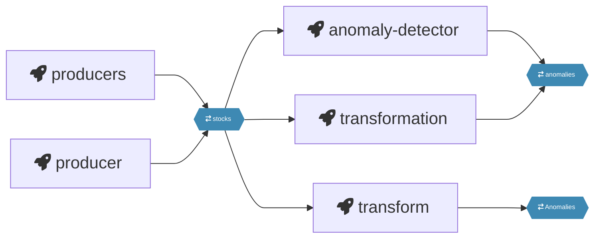

```mermaid
%%{ init: { 'flowchart': { 'curve': 'monotoneX' } } }%%
graph LR;
producers[fa:fa-rocket producers &#8205] --> stocks{{ fa:fa-arrow-right-arrow-left stocks &#8205}}:::topic;
stocks{{ fa:fa-arrow-right-arrow-left stocks &#8205}}:::topic --> anomaly-detector[fa:fa-rocket anomaly-detector &#8205];
anomaly-detector[fa:fa-rocket anomaly-detector &#8205] --> anomalies{{ fa:fa-arrow-right-arrow-left anomalies &#8205}}:::topic;
producer[fa:fa-rocket producer &#8205] --> stocks{{ fa:fa-arrow-right-arrow-left stocks &#8205}}:::topic;
stocks{{ fa:fa-arrow-right-arrow-left stocks &#8205}}:::topic --> transformation[fa:fa-rocket transformation &#8205];
transformation[fa:fa-rocket transformation &#8205] --> anomalies{{ fa:fa-arrow-right-arrow-left anomalies &#8205}}:::topic;
stocks{{ fa:fa-arrow-right-arrow-left stocks &#8205}}:::topic --> transform[fa:fa-rocket transform &#8205];
transform[fa:fa-rocket transform &#8205] --> Anomalies{{ fa:fa-arrow-right-arrow-left Anomalies &#8205}}:::topic;


classDef default font-size:110%;
classDef topic font-size:80%;
classDef topic fill:#3E89B3;
classDef topic stroke:#3E89B3;
classDef topic color:white;
```